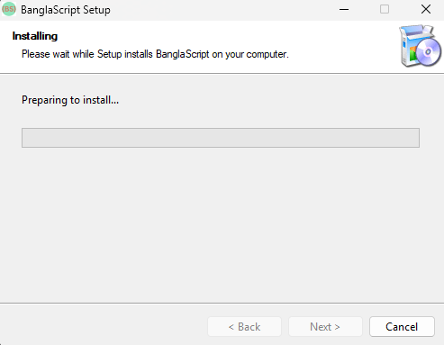
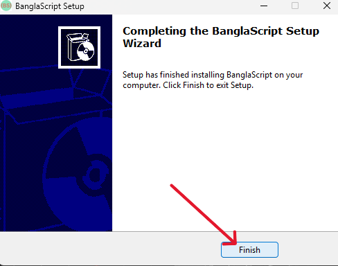
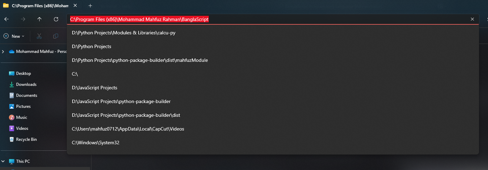
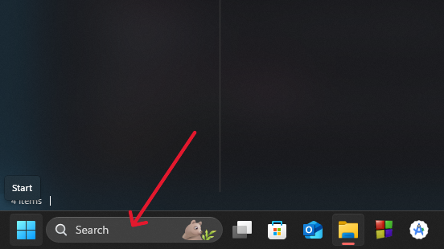
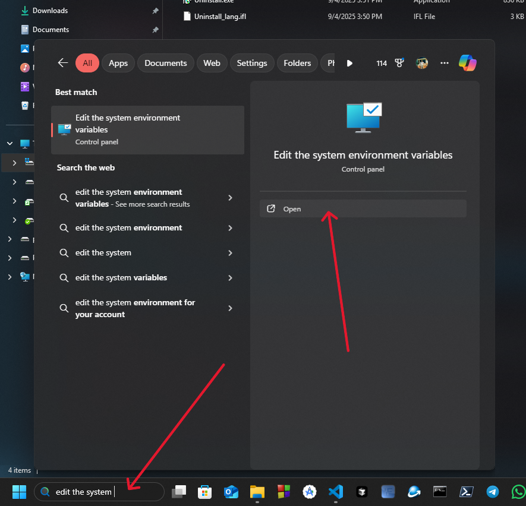
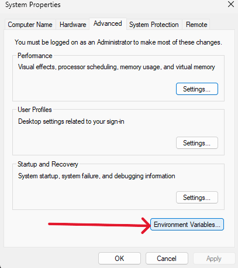
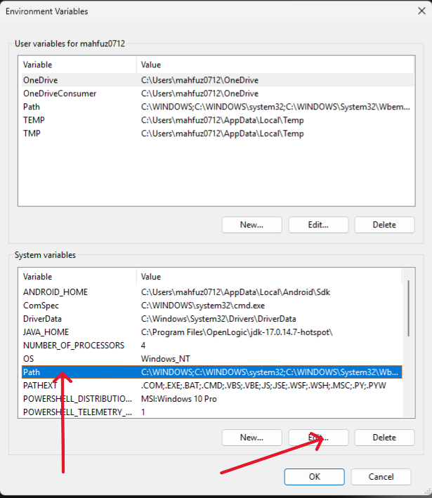
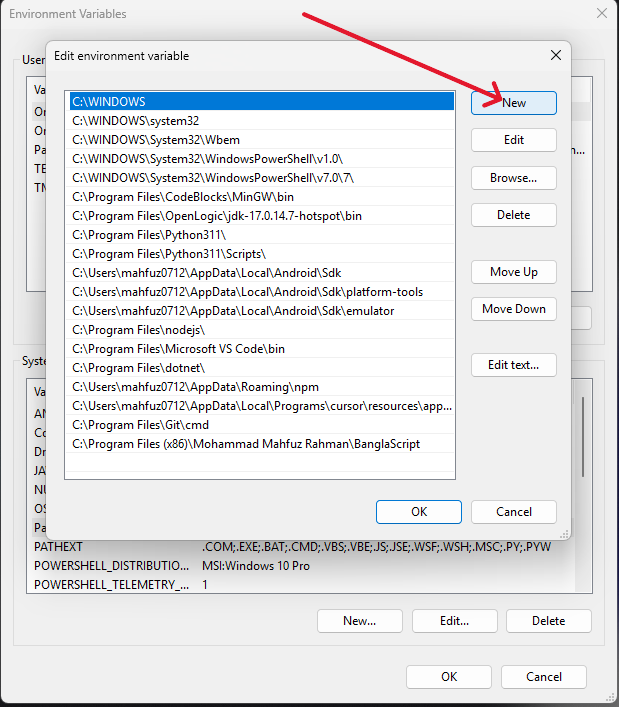
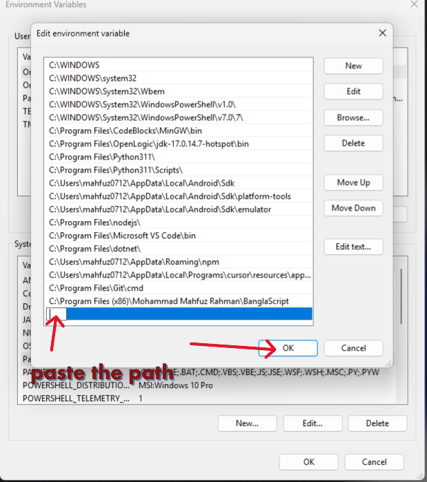

# BanglaScript Programming Language

BanglaScript is a simple, beginner-friendly programming language designed to help developers write and execute scripts in a natural and intuitive way. This documentation will guide you through the basics of BanglaScript, its syntax, and how to use the interpreter.

---

## Table of Contents
1. [Introduction](#introduction)
2. [Installation](#installation)
3. [Running BanglaScript](#running-banglascript)
4. [Examples](#examples)


---

## Introduction
BanglaScript is a lightweight scripting language that uses simple keywords to perform operations. It is designed to be easy to learn and use, especially for beginners.

---

## Installation
To use BanglaScript, ensure you have bs installed on your system. go to release section and download the latest version.


* Step 1: Download the latest release from <a href="https://bangla-script.vercel.app/" target="_blank">Website</a>


* Step 2: Double click the setup file and follow the installation instructions.


 <hr>
* Step 3: Open "C:\Program Files (x86)\Mohammad Mahfuz Rahman\BanglaScript" and copy the path. <hr>
 <hr>
 <hr>
 <hr>
* Step 4: Open Environment Variables and add the copied path to the Path variable. <hr>
 <hr>
 <hr>
 <hr>
 <hr>
 <hr>
* Step 5: Open Command Prompt and type `bs --version`. If the installation was successful, you should see the BanglaScript interpreter version. <hr>

* Step 6: To check the metadata of BanglaScript, type `bs --metadata` in the command prompt. <hr>

* Step 7: To see all the available commands, type `bs --help` in the command prompt.


---


## Running BanglaScript
To execute a BanglaScript file, use the interpreter:

```bash
bs <file_path>
```

### Example:
If your script is named `main.bs`, run:
```bash
bs main.bs
```

---

## Examples
### Example 1: Basic Variable Assignment and Printing
**main.bs**:
```
dhoro x = 5
lekho(x)
```
**Output**:
```
5
```

### Example 2: Printing Direct Values
**main.bs**:
```
lekho(10)
```
**Output**:
```
10
```
